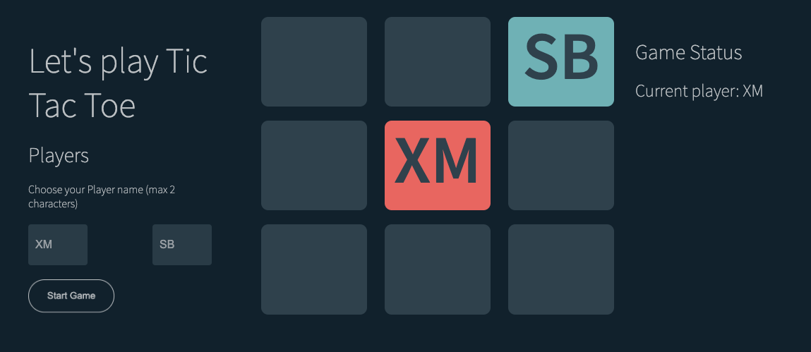

# JavaScript Project 
## Tic Tac Toe

My first apporach where I planned, executed and tested an application.

The project uses HTML, CSS and JavaScript.

### Process
1. Players type their username - both have to type - 
2. Player 1 clicks on game grid
3. Click on grid cell can only happen once
4. After play, Player 1 clicks on cell, there is a change of Player, to Player 2.
5. Player 2 clicks on cell.
6. Game decides winners
    6.1. Winning moves (combination defined of cell index). The "moves" of players will be stored and compared to the "winning moves".
    6.2. If either of the players has clicked on either of the "winning moves" that player is the winner

7. If neither of the players's moves correspond to any of the winning moves, there is a draw
The result of the game is displayed on the Results area
There might be a button to "Play Again"

### Installation instructions

1. Fork Repo instructions [here](https://docs.github.com/en/get-started/quickstart/fork-a-repo)

### Future Functionality

1. Allow users to pick their own colour
2. Store scores and allow for multiple rounds and show a final winner.